# Frigg's Gate Implementation Plan

*This document contains implementation-specific content extracted from Jackson's email notes. Copy this content to your Google Doc for external project management.*

## Deliverables & Next Steps

* Complete repo setup and commit baseline Frigg's Gate code
* Connect to real Bifröst endpoints and confirm schema alignment
* Refactor legacy components and implement Frigg-native modules
* Validate core UI flows in hybrid, structured, and unstructured modes

This implementation plan represents the disciplined realization of Frigg's Gate: a next-generation, intelligent user interface that redefines LNS system interaction.

## Target Future Architecture

### System Diagram (Component Flow)

```mermaid
graph TD
    subgraph "Input Layer"
        UnstructuredInput["📝 Unstructured Input<br/><code>UnstructuredInput.tsx</code><br/><i>Component</i>"]
        MemorySlider["🧠 Memory Slider<br/><code>MemorySlider.tsx</code><br/><i>Component</i>"]
        LeftToolTab["🧰 Tool Tab (Left)<br/><code>ToolDock.tsx</code><br/><i>Utility Tools Panel</i>"]
        RightOutputTab["📊 Structured Output Tab<br/><code>StructuredOutputDock.tsx</code><br/><i>Output Agent View</i>"]
    end

    subgraph "State & Sync Layer"
        UIStateHook["🔄 useFriggState<br/><code>useFriggState.ts</code><br/><i>Central State Hook</i>"]
        InputSyncEngine["🔗 Input Synchronizer<br/><code>useInputSync.ts</code><br/><i>Sync Unstructured → Structured</i>"]
    end

    subgraph "Agent & API Bridge"
        CypherRouter["🔁 Cypher Router<br/><code>CypherRouter.ts</code><br/><i>Agent Dispatcher</i>"]
        BifrostBridge["🌉 Bifröst API Layer<br/><code>bifrostBridge.ts</code><br/><i>Back-End Gateway</i>"]
    end

    subgraph "Render Layer"
        MainDisplay["🖥️ Main Display Container<br/><code>FriggDisplay.tsx</code><br/><i>Container Component</i>"]
        ToolRender["🧩 Tool Renderer<br/><code>ToolRenderer.tsx</code><br/><i>Structured Interaction Panel</i>"]
        InputBubble["💬 Input Display Bubble<br/><code>InputBubble.tsx</code><br/><i>User Input Visual Renderer</i>"]
    end

    UnstructuredInput -->|"user text"| UIStateHook
    MemorySlider --> UIStateHook
    UIStateHook --> InputSyncEngine
    InputSyncEngine --> CypherRouter
    LeftToolTab --> ToolRender
    RightOutputTab --> ToolRender
    CypherRouter --> BifrostBridge
    BifrostBridge --> MainDisplay
    MainDisplay --> InputBubble
    InputBubble --> ToolRender

    classDef component fill:#e1f5fe,stroke:#0277bd,stroke-width:2px
    classDef hook fill:#f3e5f5,stroke:#6a1b9a,stroke-width:2px
    classDef service fill:#ede7f6,stroke:#4527a0,stroke-width:2px
    classDef container fill:#fce4ec,stroke:#c2185b,stroke-width:2px

    class UnstructuredInput,MemorySlider,LeftToolTab,RightOutputTab,InputBubble,ToolRender component
    class UIStateHook,InputSyncEngine hook
    class CypherRouter,BifrostBridge service
    class MainDisplay container
```



## Target Architecture Insights

### Purpose

This diagram presents the **target future architecture** of Frigg's Gate: a flexible, multi-mode user interface framework that expands beyond the current implementation. It visualizes the expected runtime flow of components, interactions between state layers, and modular rendering logic across both unstructured and hybrid modes.

### Key Components (Future Implementation)

* **UnstructuredInput.tsx**: The main text box for user input, where users can freely type or speak natural language. This is where all unstructured conversations begin.

* **MemorySlider.tsx**: A horizontal scrolling component that lets the user revisit earlier conversations or prompts. It helps users refer back to older data or prompts without starting from scratch.

* **ToolDock.tsx (Left Tool Tab)**: A collapsible sidebar containing buttons or modules that link to specific tools—like mortality calculators, policy previewers, etc.

* **StructuredOutputDock.tsx (Right Tab)**: A dynamic space that displays structured agent output, such as formatted reports, summaries, or charts returned by the backend.

* **useFriggState.ts**: A central React hook managing all UI state—what the user typed, what mode they're in, and what tools are active. Think of this as the master control center.

* **useInputSync.ts**: This hook watches the unstructured input and maps it to structured field updates in the backend. It only flows one way—from natural language into form logic.

* **CypherRouter.ts**: Acts as an agent dispatcher. It decides which specialized sub-agent (like for underwriting, quoting, summarizing) should handle the input.

* **bifrostBridge.ts**: Connects the frontend to the Bifröst backend API. It formats requests and handles responses from the backend.

* **FriggDisplay.tsx**: The main screen area that arranges all the interactive pieces (input area, tool tabs, structured responses). Think of it as the frame for the user experience.

* **ToolRenderer.tsx**: Renders structured interactions or widgets in the workspace—for example, visual tables or dynamic sliders.

* **InputBubble.tsx**: Visually displays the user's submitted text in chat bubble form to reinforce interaction history and give a sense of conversational flow.

### Target File Structure

```bash
/frontend-ux/
  ├── public/
  ├── src/
  │   ├── components/
  │   │   ├── InputBubble.tsx
  │   │   ├── ToolDock.tsx
  │   │   ├── StructuredOutputDock.tsx
  │   │   ├── FriggDisplay.tsx
  │   ├── hooks/
  │   │   ├── useFriggState.ts
  │   │   ├── useInputSync.ts
  ├── package.json
  └── README.md
```

### Summary

Frigg's Gate Target Future Architecture leverages modular, agent-driven design principles to build a multi-modal interface framework adaptable to diverse LNS use cases. It expands upon the current chat-based interface to include structured interaction modes, memory management, and dynamic tool integration. This architecture supports structured expansion, agent evolution, and visual configurability at scale.

## Technology Stack Implementation Notes

### Core Technology Layers

**Runtime: Node.js** (required for development server, build processes, and tooling)

Node.js is a powerful and scalable runtime environment built on Chrome's V8 JavaScript engine. Supported by major industry players like Google, Microsoft, and IBM, it benefits from a large and active open-source community that ensures continuous updates, performance improvements, and security patches.

Node.js enables developers to run JavaScript outside of a web browser, primarily on the server-side. This means it can handle backend operations while also allowing a browser to function as the user interface (UI) for applications running locally. With this setup, a local program can manage tasks like database management, data processing, or executing utilities, while the browser serves as the front-end interface.

**Language: TypeScript**

TypeScript is a statically typed extension of JavaScript, designed to enhance JavaScript by adding static typing and modern language features. Developed and maintained by Microsoft, TypeScript has gained widespread adoption for its ability to improve code quality, maintainability, and developer productivity.

TypeScript offers additional features that focus on three key areas:

- **Type Safety and Error Prevention**: TypeScript's static typing helps catch errors during compile-time by enforcing type declarations
- **Code Organization and Reusability**: It enhances code structure with interfaces, generics, and modules, making code more maintainable and reusable
- **Advanced Language Features**: TypeScript supports modern JavaScript features like async/await and decorators, improving readability and developer experience

**Framework: React + Next.js (App Router)**

The current implementation uses Next.js 13.5.4 with App Router architecture, providing server-side rendering, automatic code splitting, and optimized performance.

### Frontend UI & Styling Implementation

**Styling: Tailwind CSS, Chakra UI**

The current implementation successfully combines:
- Tailwind CSS for utility-first styling approach
- Chakra UI for consistent component system and design tokens
- Emotion for CSS-in-JS dynamic styling capabilities

**UI Animation: Framer Motion** (Future implementation)

**Forms & Inputs:**
- AutoResizeTextarea (Currently implemented)
- Chakra UI Components (Currently implemented)

**Chat Components:**
- ChatWindow (Currently implemented)
- ChatMessageBubble (Currently implemented)
- InlineCitation (Currently implemented)
- SourceBubble (Currently implemented)

---

*Note: This document contains forward-looking implementation plans and should be used for external project management and planning purposes. The current Frigg's Gate implementation successfully provides a solid foundation for these future enhancements.*