# Frigg's Gate Implementation Plan – Technical Delivery Report to Dr. Godley

## Introduction

This document outlines the technical implementation plan for transforming Frigg’s Gate from its current scaffolded frontend into a production-ready modular interface, aligned with the architecture defined in [Artifact 2](./friggs_gate_target_architecture.md) and inspired by the frontend analysis in [Artifact 1](./Frontend_Architecture.md). Written for Dr. Godley—a technical academic with deep appreciation for architectural clarity and system modeling—this report emphasizes precision, justifiability, and cognitive reasoning in its roadmap.

---

## Objective

To implement the Frigg’s Gate architecture using a research-anchored development methodology, integrating:

* Modular component systems
* Clear agent routing infrastructure (Cypher)
* Visual flexibility (multi-mode UX)
* Scalable integration with Bifröst backend

---

## Technical Goals

1. Scaffold all UI containers, input fields, and structured panels for hybrid/unstructured use.
2. Connect the base LangChain-inspired repository to the new backend (Bifröst).
3. Begin incremental frontend redesign: renaming, pruning, and extending components.
4. Implement Cypher agent dispatching and sync logic.
5. Finalize rendering logic and visual layout.

---

## Phase Breakdown

### Phase 1 – Initial Repository Setup (Week 1)

* Fork or clone the existing LangChain Chatbot UI repository
* Create new repo: `friggs-gate-frontend`
* Clean up irrelevant branches, license headers, placeholder assets
* Retain folder structure (`components/`, `hooks/`, etc.) to bootstrap development quickly
* Verify build tools and run baseline lint/format tests

### Phase 2 – Connect to Bifröst Backend (Week 2)

* Scaffold `bifrostBridge.ts` as the primary backend integration layer
* Replace LangChain API calls in relevant files with Bifröst stubs
* Test basic echo or health-check endpoint
* Confirm JSON schema compatibility and frontend response parsing

### Phase 3 – Begin Redesign of Existing Components (Week 3–4)

* Rename LangChain-based components to new Frigg-based naming convention (`ChatBubble.tsx` → `InputBubble.tsx`, etc.)
* Remove unnecessary wrappers or features not used in Frigg’s Gate (e.g., inline citations, markdown previews)
* Add memory slider, new structured input panels, and flexible docking interfaces
* Start refactoring state logic into `useFriggState.ts` and `useInputSync.ts`

### Phase 4 – Agent Dispatch Logic (Week 5–6)

* Build `CypherRouter.ts` with modular agent schemas
* Use conditional routing rules to simulate context-aware backend selection
* Coordinate with Bifröst team to validate agent identifiers and expected output formats

### Phase 5 – Input Rendering, Memory, and Visual Feedback (Week 7–8)

* Connect unstructured input to `InputBubble.tsx`
* Build and test `MemorySlider.tsx` across local conversation history
* Sync input-to-structure via `useInputSync.ts`
* Complete visual layout of hybrid and unstructured modes

### Phase 6 – QA, Polish, and Developer Annotations (Week 9–10)

* Refactor for consistent naming, styling, and layout behaviors
* Add inline code annotations for major hooks and interfaces
* Document handoff and structure in `README.md`
* Final visual walkthrough of each interaction mode

---

## Implementation Graph (Mermaid)

```mermaid
graph TD
  Repo["📦 Setup New Repo from LangChain"] --> Bifrost["🌉 Connect to Bifröst Backend"]
  Bifrost --> Redesign["🔧 Begin Component Redesign"]
  Redesign --> Router["🔀 Cypher Router"]
  Router --> Visuals["💬 Input Rendering & Memory"]
  Visuals --> QA["✅ QA + Annotate"]
```



---

## Contracts & Interfaces

| Layer             | Interface                 | Purpose                          |
| ----------------- | ------------------------- | -------------------------------- |
| Frontend ↔ Agent  | `CypherRouter.ts`         | Agent selection, context routing |
| Agent ↔ Backend   | `bifrostBridge.ts`        | HTTP layer, schema formatting    |
| State ↔ UI        | `useFriggState.ts`, props | Mode awareness, memory indexing  |
| Input ↔ Structure | `useInputSync.ts`         | One-way binding to schema        |

---

## Why This Architecture Will Work

* **Cognitive UX Compliance**: It models user state, structure, and interaction visually and in code.
* **Academic Rigor**: The system is broken into traceable logical modules that align with clean contract boundaries.
* **Future Compatibility**: Enables plug-and-play growth—structured outputs, tab-based utility tools, and backend routing.
* **Reference-First Thinking**: Builds upon LangChain concepts and your own lessons from \[Artifact 1], preserving familiar logic but scaling it.

---

## Deliverables & Next Steps

* Complete repo setup and commit baseline Frigg’s Gate code
* Connect to real Bifröst endpoints and confirm schema alignment
* Refactor legacy components and implement Frigg-native modules
* Validate core UI flows in hybrid, structured, and unstructured modes

This implementation plan represents the disciplined realization of Frigg’s Gate: a next-generation, intelligent user interface that redefines LNS system interaction.


# Frigg's Gate Target Architecture – Production-Ready Design

## System Diagram (Component Flow)


---

## Architectural Insights

### Purpose

This diagram presents the **target architecture** of Frigg's Gate: a flexible, multi-mode user interface framework inspired by the LangChain frontend but fundamentally adapted for the needs of the **Life Nervous System (LNS)**. It visualizes the expected runtime flow of components, interactions between state layers, and modular rendering logic across both unstructured and hybrid modes.

### Key Observations (What Each Part Does)

* **UnstructuredInput.tsx**: The main text box for user input, where users can freely type or speak natural language. This is where all unstructured conversations begin.

* **MemorySlider.tsx**: A horizontal scrolling component that lets the user revisit earlier conversations or prompts. It helps users refer back to older data or prompts without starting from scratch.

* **ToolDock.tsx (Left Tool Tab)**: A collapsible sidebar containing buttons or modules that link to specific tools—like mortality calculators, policy previewers, etc.

* **StructuredOutputDock.tsx (Right Tab)**: A dynamic space that displays structured agent output, such as formatted reports, summaries, or charts returned by the backend.

* **useFriggState.ts**: A central React hook managing all UI state—what the user typed, what mode they’re in, and what tools are active. Think of this as the master control center.

* **useInputSync.ts**: This hook watches the unstructured input and maps it to structured field updates in the backend. It only flows one way—from natural language into form logic.

* **CypherRouter.ts**: Acts as an agent dispatcher. It decides which specialized sub-agent (like for underwriting, quoting, summarizing) should handle the input.

* **bifrostBridge.ts**: Connects the frontend to the Bifröst backend API. It formats requests and handles responses from the LangGraph-powered agent backend.

* **FriggDisplay.tsx**: The main screen area that arranges all the interactive pieces (input area, tool tabs, structured responses). Think of it as the frame for the user experience.

* **ToolRenderer.tsx**: Renders structured interactions or widgets in the workspace—for example, visual tables or dynamic sliders.

* **InputBubble.tsx**: Visually displays the user's submitted text in chat bubble form to reinforce interaction history and give a sense of conversational flow.

### Infrastructure Alignment

* **Component Naming** modeled after LangChain (e.g., `AutoResizeTextarea.tsx`) for parity and familiarity【66†source】
* **Modified Hierarchy** reflects introduction of new UX features like memory scrolling, dynamic tool tabs, and multiple display modes【56†source】
* **Hooks & Bridges** offer clean contract points to orchestrate logic, agent behavior, and Sigrún integrations【69†source】

### Target File Structure

```bash
/frontend-ux/
  ├── public/
  ├── src/
  │   ├── components/
  │   │   ├── InputBubble.tsx
  │   │   ├── ToolDock.tsx
  │   │   ├── StructuredOutputDock.tsx
  │   │   ├── FriggDisplay.tsx
  │   ├── hooks/
  │   │   ├── useFriggState.ts
  │   │   ├── useInputSync.ts
  │   ├── api/
  │   │   ├── bifrostBridge.ts
  │   ├── agents/
  │   │   ├── CypherRouter.ts
  │   ├── styles/
  │   └── pages/
  ├── package.json
  └── README.md
```

### Summary

Frigg’s Gate Target Architecture leverages modular, agent-driven design principles to build a multi-modal interface framework adaptable to diverse LNS use cases. It replaces LangChain’s static chat workflow with a dynamic, extensible user interface aligned to both commercial and cognitive UX goals. This architecture supports structured expansion, agent evolution, and visual configurability at scale.


⚙️ Core Technology Layers

Runtime: Node.js (required for development server, build processes, and tooling)

Node.js is a powerful and scalable runtime environment built on Chrome's V8 JavaScript engine. Supported by major industry players like Google, Microsoft, and IBM, it benefits from a large and active open-source community that ensures continuous updates, performance improvements, and security patches. As one of the most popular runtimes for building modern, high-performance applications, Node.js is a key component of the technology stack.

Node.js enables developers to run JavaScript outside of a web browser, primarily on the server-side. This means it can handle backend operations while also allowing a browser to function as the user interface (UI) for applications running locally, such as on a Linux machine. With this setup, a local program can manage tasks like database management, data processing, or executing utilities, while the browser serves as the front-end interface. This creates a seamless user experience for interacting with the program in real-time, all through a web browser.

In this scenario, Node.js processes all backend logic locally, handling the server-side functionality, while the browser is used to display results, manage user inputs (e.g., forms or commands), and show real-time updates. This setup combines the power of server-side operations with the simplicity of a browser-based front end, offering a lightweight solution without the need for a full desktop application. It highlights how Node.js can serve as the backend engine for local tools and utilities, enabling scalable, real-time interactions even in local environments.

Node.js excels at building fast and efficient applications, especially for tasks like APIs, web servers, and real-time data streaming. Its single-threaded, non-blocking, and event-driven architecture are key to its performance.

Single-threaded: Node.js uses just one thread to handle all tasks. Instead of creating multiple threads for different tasks (which can be heavy on memory and resources), Node.js handles everything with a single thread, making it lightweight and faster.


Non-blocking: Node.js doesn't wait for tasks (like reading from a file or querying a database) to finish before moving on to other tasks. It continues working on other tasks while waiting for one task to complete, ensuring that it doesn’t get stuck and can handle multiple operations at once.


Event-driven: Node.js uses an event loop to manage tasks. The event loop waits for tasks to be ready (like a database response), picks them up when they are ready, and processes them in the correct order. This ensures efficient task handling without wasting time.

These features allow Node.js to manage many requests concurrently without slowing down or consuming excessive resources. It avoids bottlenecks that can occur in other systems and is ideal for applications like web servers, live communication apps, or any platform that needs to handle real-time data efficiently.

Node.js is essential in your technology stack because it powers the development server, handles build processes, and serves as the foundation for various tooling. It facilitates the execution of JavaScript code server-side, enabling smooth interaction with databases, file systems, and external APIs, all while maintaining high performance.

Additionally, Node.js is highly extensible, with a vast ecosystem of packages available through npm (Node Package Manager), which simplifies the inclusion of third-party libraries and further extends its capabilities.

Installation and Versioning


Language: TypeScript

When using TypeScript, the code you write is ultimately compiled down to JavaScript, which is what the browser executes. TypeScript enhances JavaScript by adding features like static typing and modern programming tools. However, at the end of the process, it’s JavaScript that handles the dynamic rendering and functionality in the browser.

TypeScript is a statically typed extension of JavaScript, designed to enhance JavaScript by adding static typing and modern language features. Developed and maintained by Microsoft, TypeScript has gained widespread adoption for its ability to improve code quality, maintainability, and developer productivity. TypeScript is fully compatible with JavaScript, so any valid JavaScript code is also valid TypeScript code.

TypeScript offers additional features that focus on three key areas:

Type Safety and Error Prevention: TypeScript’s static typing helps catch errors during compile-time by enforcing type declarations, such as specifying a variable as a number (e.g., let age: number = 25;), unlike JavaScript, where the type is determined and inferred at runtime, which can lead to potential runtime bugs.

Code Organization and Reusability: It enhances code structure with interfaces, generics, and modules, making code more maintainable and reusable.

Advanced Language Features: TypeScript supports modern JavaScript features like async/await and decorators, improving readability and developer experience.

With TypeScript, developers can write more robust and scalable code while still leveraging the vast ecosystem of JavaScript libraries.

In a typical development workflow, TypeScript is used alongside modern JavaScript frameworks and tools, such as React, Next.js, and Node.js, to provide enhanced developer tooling, including autocompletion, type checking, and refactoring tools. This enables a smoother development experience and reduces the risk of introducing runtime errors.

Framework: React + Next.js (App Router)


🎨 Frontend UI & Styling
Styling: Tailwind CSS, Chakra UI


UI Animation: Framer Motion


Forms & Inputs:


AutoResizeTextarea


Chakra UI Components


Chat Components:


ChatWindow


ChatMessageBubble


InlineCitation


SourceBubble
# Frigg's Gate Target Architecture – Production-Ready Design

## System Diagram (Component Flow)


---

## Architectural Insights

### Purpose

This diagram presents the **target architecture** of Frigg's Gate: a flexible, multi-mode user interface framework inspired by the LangChain frontend but fundamentally adapted for the needs of the **Life Nervous System (LNS)**. It visualizes the expected runtime flow of components, interactions between state layers, and modular rendering logic across both unstructured and hybrid modes.

### Key Observations (What Each Part Does)

* **UnstructuredInput.tsx**: The main text box for user input, where users can freely type or speak natural language. This is where all unstructured conversations begin.

* **MemorySlider.tsx**: A horizontal scrolling component that lets the user revisit earlier conversations or prompts. It helps users refer back to older data or prompts without starting from scratch.

* **ToolDock.tsx (Left Tool Tab)**: A collapsible sidebar containing buttons or modules that link to specific tools—like mortality calculators, policy previewers, etc.

* **StructuredOutputDock.tsx (Right Tab)**: A dynamic space that displays structured agent output, such as formatted reports, summaries, or charts returned by the backend.

* **useFriggState.ts**: A central React hook managing all UI state—what the user typed, what mode they’re in, and what tools are active. Think of this as the master control center.

* **useInputSync.ts**: This hook watches the unstructured input and maps it to structured field updates in the backend. It only flows one way—from natural language into form logic.

* **CypherRouter.ts**: Acts as an agent dispatcher. It decides which specialized sub-agent (like for underwriting, quoting, summarizing) should handle the input.

* **bifrostBridge.ts**: Connects the frontend to the Bifröst backend API. It formats requests and handles responses from the LangGraph-powered agent backend.

* **FriggDisplay.tsx**: The main screen area that arranges all the interactive pieces (input area, tool tabs, structured responses). Think of it as the frame for the user experience.

* **ToolRenderer.tsx**: Renders structured interactions or widgets in the workspace—for example, visual tables or dynamic sliders.

* **InputBubble.tsx**: Visually displays the user's submitted text in chat bubble form to reinforce interaction history and give a sense of conversational flow.

### Infrastructure Alignment

* **Component Naming** modeled after LangChain (e.g., `AutoResizeTextarea.tsx`) for parity and familiarity【66†source】
* **Modified Hierarchy** reflects introduction of new UX features like memory scrolling, dynamic tool tabs, and multiple display modes【56†source】
* **Hooks & Bridges** offer clean contract points to orchestrate logic, agent behavior, and Sigrún integrations【69†source】

### Target File Structure

```bash
/frontend-ux/
  ├── public/
  ├── src/
  │   ├── components/
  │   │   ├── InputBubble.tsx
  │   │   ├── ToolDock.tsx
  │   │   ├── StructuredOutputDock.tsx
  │   │   ├── FriggDisplay.tsx
  │   ├── hooks/
  │   │   ├── useFriggState.ts
  │   │   ├── useInputSync.ts
  │   ├── api/
  │   │   ├── bifrostBridge.ts
  │   ├── agents/
  │   │   ├── CypherRouter.ts
  │   ├── styles/
  │   └── pages/
  ├── package.json
  └── README.md
```

### Summary

Frigg’s Gate Target Architecture leverages modular, agent-driven design principles to build a multi-modal interface framework adaptable to diverse LNS use cases. It replaces LangChain’s static chat workflow with a dynamic, extensible user interface aligned to both commercial and cognitive UX goals. This architecture supports structured expansion, agent evolution, and visual configurability at scale.


⚙️ Core Technology Layers

Runtime: Node.js (required for development server, build processes, and tooling)

Node.js is a powerful and scalable runtime environment built on Chrome's V8 JavaScript engine. Supported by major industry players like Google, Microsoft, and IBM, it benefits from a large and active open-source community that ensures continuous updates, performance improvements, and security patches. As one of the most popular runtimes for building modern, high-performance applications, Node.js is a key component of the technology stack.

Node.js enables developers to run JavaScript outside of a web browser, primarily on the server-side. This means it can handle backend operations while also allowing a browser to function as the user interface (UI) for applications running locally, such as on a Linux machine. With this setup, a local program can manage tasks like database management, data processing, or executing utilities, while the browser serves as the front-end interface. This creates a seamless user experience for interacting with the program in real-time, all through a web browser.

In this scenario, Node.js processes all backend logic locally, handling the server-side functionality, while the browser is used to display results, manage user inputs (e.g., forms or commands), and show real-time updates. This setup combines the power of server-side operations with the simplicity of a browser-based front end, offering a lightweight solution without the need for a full desktop application. It highlights how Node.js can serve as the backend engine for local tools and utilities, enabling scalable, real-time interactions even in local environments.

Node.js excels at building fast and efficient applications, especially for tasks like APIs, web servers, and real-time data streaming. Its single-threaded, non-blocking, and event-driven architecture are key to its performance.

Single-threaded: Node.js uses just one thread to handle all tasks. Instead of creating multiple threads for different tasks (which can be heavy on memory and resources), Node.js handles everything with a single thread, making it lightweight and faster.


Non-blocking: Node.js doesn't wait for tasks (like reading from a file or querying a database) to finish before moving on to other tasks. It continues working on other tasks while waiting for one task to complete, ensuring that it doesn’t get stuck and can handle multiple operations at once.


Event-driven: Node.js uses an event loop to manage tasks. The event loop waits for tasks to be ready (like a database response), picks them up when they are ready, and processes them in the correct order. This ensures efficient task handling without wasting time.

These features allow Node.js to manage many requests concurrently without slowing down or consuming excessive resources. It avoids bottlenecks that can occur in other systems and is ideal for applications like web servers, live communication apps, or any platform that needs to handle real-time data efficiently.

Node.js is essential in your technology stack because it powers the development server, handles build processes, and serves as the foundation for various tooling. It facilitates the execution of JavaScript code server-side, enabling smooth interaction with databases, file systems, and external APIs, all while maintaining high performance.

Additionally, Node.js is highly extensible, with a vast ecosystem of packages available through npm (Node Package Manager), which simplifies the inclusion of third-party libraries and further extends its capabilities.

Installation and Versioning


Language: TypeScript

When using TypeScript, the code you write is ultimately compiled down to JavaScript, which is what the browser executes. TypeScript enhances JavaScript by adding features like static typing and modern programming tools. However, at the end of the process, it’s JavaScript that handles the dynamic rendering and functionality in the browser.

TypeScript is a statically typed extension of JavaScript, designed to enhance JavaScript by adding static typing and modern language features. Developed and maintained by Microsoft, TypeScript has gained widespread adoption for its ability to improve code quality, maintainability, and developer productivity. TypeScript is fully compatible with JavaScript, so any valid JavaScript code is also valid TypeScript code.

TypeScript offers additional features that focus on three key areas:

Type Safety and Error Prevention: TypeScript’s static typing helps catch errors during compile-time by enforcing type declarations, such as specifying a variable as a number (e.g., let age: number = 25;), unlike JavaScript, where the type is determined and inferred at runtime, which can lead to potential runtime bugs.

Code Organization and Reusability: It enhances code structure with interfaces, generics, and modules, making code more maintainable and reusable.

Advanced Language Features: TypeScript supports modern JavaScript features like async/await and decorators, improving readability and developer experience.

With TypeScript, developers can write more robust and scalable code while still leveraging the vast ecosystem of JavaScript libraries.

In a typical development workflow, TypeScript is used alongside modern JavaScript frameworks and tools, such as React, Next.js, and Node.js, to provide enhanced developer tooling, including autocompletion, type checking, and refactoring tools. This enables a smoother development experience and reduces the risk of introducing runtime errors.

Framework: React + Next.js (App Router)


🎨 Frontend UI & Styling
Styling: Tailwind CSS, Chakra UI


UI Animation: Framer Motion


Forms & Inputs:


AutoResizeTextarea


Chakra UI Components


Chat Components:


ChatWindow


ChatMessageBubble


InlineCitation


SourceBubble
🧩 Assembly Phase
With the core concepts and vision in place, Frigg’s Gate is now entering its assembly phase—where interface, infrastructure, and orchestration are actively coming together. The LangChain chat_interface has been rebranded and adopted as the production foundation for Frigg’s Gate, now wired to the Bifröst backend via its /ask API. Both the web interface and GateTester are operational and connect to the same cognitive backend, establishing a functional feedback loop between UX and orchestration logic.
📘 Conceptual Framework and Architectural Blueprint
We are currently developing the Frigg’s Gate Conceptual Guide and the Architectural Blueprint, which together define the design philosophy, system boundaries, and extension principles of the platform. This work is foundational—it is how we will build the depth of understanding needed to confidently modify, extend, and scale the system over time.
🖼 Frigg’s Gate Front End Styling and Interaction Layer
In parallel, we are advancing styling and interaction improvements within the Frigg’s Gate frontend. This includes changes such as font updates and visual refinements to the LangChain-based UI. These smaller interface adjustments are part of an intentional learning process—helping us explore how to evolve structured input modes, refine markdown rendering, and build toward a more robust, user-friendly interface for structured and hybrid tasks.
👁 GateTester Visual Clarity and Demo Viability
GateTester is undergoing aesthetic upgrades aimed at improving its on-screen visual clarity and presentation quality. While currently operating via a terminal interface, we are exploring styling patterns inspired by well-designed CLI chat systems. The goal is to create a tool that not only supports internal simulation and debugging, but can also be used for live demos—allowing engagement  with Frigg’s Gate’s backend logic without launching the full web frontend.
🌀 Bifröst Cognitive Backend and Orchestration Layer
Bifröst development is now a primary focus. As the orchestration layer that connects Frigg’s Gate to all backend tools, Bifröst is where the cognitive architecture takes shape—handling intent parsing, memory, agent dispatch, and multi-step task coordination. To meaningfully demonstrate orchestration behavior, this work is proceeding in tandem with two core tool integrations: Quick Quote and the Life Expectancy Calculator. Together, these enable us to validate the orchestration pattern across distinct product domains and begin shaping the persistent cognitive foundation of the Life Nervous System.