```mermaid
graph TD
    subgraph "Input Layer"
        UnstructuredInput["📝 Unstructured Input<br/><code>UnstructuredInput.tsx</code><br/><i>Component</i>"]
        MemorySlider["🧠 Memory Slider<br/><code>MemorySlider.tsx</code><br/><i>Component</i>"]
        LeftToolTab["🧰 Tool Tab (Left)<br/><code>ToolDock.tsx</code><br/><i>Utility Tools Panel</i>"]
        RightOutputTab["📊 Structured Output Tab<br/><code>StructuredOutputDock.tsx</code><br/><i>Output Agent View</i>"]
    end

    subgraph "State & Sync Layer"
        UIStateHook["🔄 useFriggState<br/><code>useFriggState.ts</code><br/><i>Central State Hook</i>"]
        InputSyncEngine["🔗 Input Synchronizer<br/><code>useInputSync.ts</code><br/><i>Sync Unstructured → Structured</i>"]
    end

    subgraph "Agent & API Bridge"
        CypherRouter["🔁 Cypher Router<br/><code>CypherRouter.ts</code><br/><i>Agent Dispatcher</i>"]
        BifrostBridge["🌉 Bifröst API Layer<br/><code>bifrostBridge.ts</code><br/><i>Back-End Gateway</i>"]
    end

    subgraph "Render Layer"
        MainDisplay["🖥️ Main Display Container<br/><code>FriggDisplay.tsx</code><br/><i>Container Component</i>"]
        ToolRender["🧩 Tool Renderer<br/><code>ToolRenderer.tsx</code><br/><i>Structured Interaction Panel</i>"]
        InputBubble["💬 Input Display Bubble<br/><code>InputBubble.tsx</code><br/><i>User Input Visual Renderer</i>"]
    end

    UnstructuredInput -->|"user text"| UIStateHook
    MemorySlider --> UIStateHook
    UIStateHook --> InputSyncEngine
    InputSyncEngine --> CypherRouter
    LeftToolTab --> ToolRender
    RightOutputTab --> ToolRender
    CypherRouter --> BifrostBridge
    BifrostBridge --> MainDisplay
    MainDisplay --> InputBubble
    InputBubble --> ToolRender

    classDef component fill:#e1f5fe,stroke:#0277bd,stroke-width:2px
    classDef hook fill:#f3e5f5,stroke:#6a1b9a,stroke-width:2px
    classDef service fill:#ede7f6,stroke:#4527a0,stroke-width:2px
    classDef container fill:#fce4ec,stroke:#c2185b,stroke-width:2px

    class UnstructuredInput,MemorySlider,LeftToolTab,RightOutputTab,InputBubble,ToolRender component
    class UIStateHook,InputSyncEngine hook
    class CypherRouter,BifrostBridge service
    class MainDisplay container
```

# 2. 🖼  Frigg’s Gate (Frontend Interface Layer)

## 2.1 Runtime: Node.js Architecture and Event-Driven Model

**Node.js** is a runtime environment built on Chrome’s V8 JavaScript engine, ideal for Frigg's Gate's real-time needs. Created by Ryan Dahl in 2009, it was later developed by Joyent, which helped grow its early adoption.

In 2015, governance concerns led to the Node.js Foundation under the Linux Foundation, uniting major players like IBM, Microsoft, and PayPal. In 2019, it merged with the JS Foundation to form the **OpenJS Foundation**, which now oversees Node.js and many key JavaScript projects, backed by companies such as Google, Microsoft, and Meta.

**Why Node.js for Frigg's Gate:**

Node.js excels at building fast and efficient applications through its unique architectural approach and other considerations:

**Single-threaded Operations**: Node.js uses one primary thread to handle all tasks, making it lightweight and memory-efficient. Instead of creating multiple threads for different operations, this approach reduces overhead and complexity.

**Non-blocking I/O**: The runtime doesn't wait for operations like API calls or file reads to complete before moving to other tasks. This is crucial for Frigg's Gate's real-time chat interface, where multiple user interactions can occur simultaneously.

**Event-driven Architecture**: The event loop manages tasks efficiently, picking up completed operations and processing them in the correct order. This ensures smooth handling of streaming responses from Bifröst without blocking the user interface.

**Performance Benefits for Frigg's Gate:**
- Handles multiple concurrent chat sessions without performance degradation
- Manages real-time streaming responses from the backend efficiently
- Supports rapid development iteration with fast server restart times
- Enables seamless integration with the vast npm ecosystem for extending functionality

**Local Development Advantages:**
Node.js enables Frigg's Gate to run entirely locally, with the browser serving as the interface to a locally-running backend. This setup provides:
- Complete data privacy and security
- No dependency on external hosting during development
- Real-time debugging and development capabilities
- Seamless integration with local development tools


## 2.2 Language: TypeScript Compilation and Type Safety

**TypeScript** enhances JavaScript by adding static typing and modern language features, providing crucial benefits for Frigg's Gate's complex component architecture.

**Type Safety Benefits:**
TypeScript's compile-time type checking prevents runtime errors that could disrupt user conversations. For example, message payload structures are strictly typed, ensuring consistent communication with the Bifröst backend:

```typescript
interface ChatMessage {
  content: string;
  role: 'user' | 'assistant';
  timestamp: string;
  sources?: SourceReference[];
  metadata?: MessageMetadata;
}
```

**Developer Experience Enhancements:**
- **Intelligent Autocompletion**: IDE support provides accurate suggestions for component props and API responses
- **Refactoring Safety**: Large-scale code changes are validated at compile time
- **Documentation Integration**: Type definitions serve as living documentation for component interfaces

**Code Organization Benefits:**
TypeScript's interfaces and generics enable clear contracts between components, making the codebase more maintainable as Frigg's Gate evolves. This is particularly important for the modular component architecture that supports different interaction modes.

**Compilation Process:**
During development, TypeScript code is compiled to JavaScript in real-time, enabling immediate feedback. The final browser-executed code is optimized JavaScript, ensuring maximum runtime performance.

## 2.3 Framework: React + Next.js App Router Paradigm

**React** provides the component-based architecture that models Frigg's Gate's modular interface design. **Next.js App Router** adds powerful routing, rendering, and optimization capabilities.

**React Component Architecture:**
React's declarative approach perfectly matches Frigg's Gate's need for dynamic, state-driven interfaces. Components like `ChatWindow` and `ChatMessageBubble` can respond to changing conversation state while maintaining predictable behavior.

**Next.js App Router Benefits:**
- **File-based Routing**: URL structure matches the file system, making navigation intuitive
- **Server Components**: Optimal performance through selective server-side rendering
- **Streaming**: Progressive page loading that enhances perceived performance
- **Automatic Code Splitting**: Only necessary JavaScript is loaded for each route

**Real-time Capabilities:**
The combination enables Frigg's Gate to handle streaming responses from Bifröst, updating the interface progressively as new content arrives. This creates the smooth, conversational experience central to the gateway metaphor.

**Scalability Considerations:**
As Frigg's Gate evolves to support multiple interaction modes (structured, unstructured, hybrid), React's component model and Next.js's routing capabilities provide the foundation for seamless feature expansion.

## 2.4 Styling: Tailwind CSS + Chakra UI Integration

**Tailwind CSS** provides utility-first styling that enables rapid interface development, while **Chakra UI** contributes pre-built components that maintain consistency and accessibility.

**Tailwind CSS Advantages:**
- **Utility-First Approach**: Styles are applied directly in components, reducing context switching
- **Responsive Design**: Built-in breakpoint system ensures Frigg's Gate works across devices
- **Customization**: Extensive configuration options allow alignment with LNS branding
- **Performance**: Unused styles are automatically purged from production builds

**Chakra UI Integration:**
- **Accessibility**: Components include ARIA attributes and keyboard navigation by default
- **Theme Consistency**: Centralized design system ensures visual coherence
- **Component Library**: Pre-built elements like buttons and modals accelerate development
- **Dark Theme Support**: Native dark mode capabilities align with Frigg's Gate's aesthetic

**Visual Hierarchy:**
The combination creates a sophisticated visual language that supports the mythical gateway concept while maintaining professional usability. Dark themes with carefully chosen accent colors reinforce the system's advanced, mystical character.

## 2.5 Build Toolchain and Dependency Management

**Yarn Package Manager** handles dependency resolution and installation, providing faster and more reliable builds than npm. The lock file ensures consistent dependency versions across development environments.

**Build Process Components:**
- **TypeScript Compiler**: Converts TypeScript to optimized JavaScript
- **Next.js Build System**: Handles bundling, optimization, and asset management
- **PostCSS Processing**: Transforms and optimizes CSS, including Tailwind compilation
- **ESLint Integration**: Enforces code quality and consistency standards

**Development Workflow:**
The development server provides hot reloading, enabling immediate feedback during interface development. Changes to components or styles are reflected instantly in the browser, accelerating the iteration cycle.

**Production Optimization:**
Build processes include automatic optimization through tree shaking, code splitting, and asset compression. This ensures Frigg's Gate loads quickly and performs efficiently in production environments.

---

# 3. Application Architecture

## 3.1 Next.js App Router Structure and File Organization

Frigg's Gate leverages Next.js App Router's file-based routing system to create an intuitive project structure that mirrors the user experience:

```
frontend/
├── app/
│   ├── layout.tsx          # Root layout with global providers
│   ├── page.tsx            # Main chat interface entry point
│   ├── globals.css         # Global styling and theme definitions
│   └── components/
│       ├── ChatWindow.tsx           # Primary interface orchestration
│       ├── ChatMessageBubble.tsx    # Individual message rendering
│       ├── EmptyState.tsx          # Welcome screen and action cards
│       ├── AutoResizeTextarea.tsx   # Dynamic input component
│       ├── InlineCitation.tsx      # Source reference display
│       └── SourceBubble.tsx        # Source information cards
├── utils/
│   ├── constants.tsx       # Configuration and API endpoints
│   └── sendFeedback.tsx    # User interaction tracking
└── public/
    ├── favicon.ico         # Application branding
    └── images/             # Static assets and icons
```

**Architectural Principles:**

**Colocated Functionality**: Related components, utilities, and styles are organized together, reducing cognitive overhead during development and maintenance.

**Clear Separation of Concerns**: The structure distinguishes between layout (`layout.tsx`), routing (`page.tsx`), UI components (`components/`), business logic (`utils/`), and static assets (`public/`).

**Scalable Organization**: As Frigg's Gate evolves to support multiple interaction modes, the structure can accommodate new routes and component hierarchies without requiring major reorganization.

## 3.2 Component Hierarchy and Modular Design

Frigg's Gate's component architecture follows a hierarchical pattern that mirrors the user experience flow:

```
App (layout.tsx)
├── ChakraProvider (styling context)
├── Page (page.tsx)
    └── ChatWindow (main interface)
        ├── EmptyState (initial welcome)
        │   └── ActionCards (quick actions)
        ├── MessageList (conversation history)
        │   └── ChatMessageBubble (individual messages)
        │       ├── InlineCitation (source references)
        │       └── SourceBubble (source details)
        └── InputArea
            └── AutoResizeTextarea (user input)
```

**Design Patterns:**

**Container-Presentation Pattern**: Components like `ChatWindow` handle state and logic, while presentational components like `ChatMessageBubble` focus on rendering and user interaction.

**Composition Over Inheritance**: Complex interfaces are built by composing smaller, focused components rather than creating monolithic structures.

**Props-Based Communication**: Components communicate through well-defined prop interfaces, enabling easy testing and reusability.

**State Co-location**: Component state is managed as close to its usage as possible, reducing unnecessary prop drilling and improving performance.

## 3.3 State Management Patterns and Data Flow

Frigg's Gate employs a **centralized state management** approach within the `ChatWindow` component, with specific patterns for different types of state:

**Conversation State:**
```typescript
const [messages, setMessages] = useState<ChatMessage[]>([]);
const [isLoading, setIsLoading] = useState(false);
const [currentModel, setCurrentModel] = useState<string>('gpt-4');
```

**UI State:**
```typescript
const [inputValue, setInputValue] = useState('');
const [showSources, setShowSources] = useState(true);
const [feedbackState, setFeedbackState] = useState<FeedbackState>({});
```

**Data Flow Patterns:**

**Unidirectional Data Flow**: State changes flow down through props, while events bubble up through callback functions. This predictable pattern makes debugging and testing straightforward.

**Event-Driven Updates**: User actions trigger state updates that cascade through the component tree, ensuring the interface stays synchronized with the current conversation state.

**Optimistic Updates**: The interface updates immediately for user actions (like sending a message), with error handling for failed operations.

**State Persistence**: Critical state like conversation history is maintained across component re-renders, with future architecture supporting persistence across sessions.

## 3.4 API Integration Layer with Bifröst Backend

The integration layer abstracts backend communication behind a clean interface, enabling easy testing and future backend evolution:

**API Constants and Configuration:**
```typescript
// utils/constants.tsx
export const API_BASE_URL = process.env.NEXT_PUBLIC_API_BASE_URL || 'http://localhost:8000';
```

**Communication Protocol:**
Frigg's Gate communicates with Bifröst using structured JSON payloads:

```typescript
interface BifrostRequest {
  question: string;
  chat_history: ChatMessage[];
  metadata: {
    caller: string;
    purpose: string;
    timestamp: string;
  };
  session: {
    user_id: string;
    context: Record<string, any>;
  };
  stream: boolean;
}
```

**Streaming Response Handling:**
The frontend supports real-time streaming responses from Bifröst, updating the interface progressively as content arrives:

```typescript
const handleStream = async (response: Response) => {
  const reader = response.body?.getReader();
  const decoder = new TextDecoder();
  
  while (true) {
    const { value, done } = await reader.read();
    if (done) break;
    
    const chunk = decoder.decode(value);
    // Update interface with partial response
    updateMessageContent(chunk);
  }
};
```

**Error Handling Strategy:**
Robust error handling ensures graceful degradation when backend services are unavailable:
- Connection timeouts with user-friendly messages
- Retry mechanisms for transient failures
- Fallback responses for critical errors
- Error logging for debugging and monitoring

## 3.5 Configuration and Environment Management

Frigg's Gate uses environment-based configuration to support different deployment contexts:

**Environment Variables:**
```bash
NEXT_PUBLIC_API_BASE_URL=http://localhost:8000  # Development
NEXT_PUBLIC_API_BASE_URL=https://api.lns.prod   # Production
```

**Configuration Layers:**

**Build-time Configuration**: TypeScript compilation settings, build optimization parameters, and static asset handling configured in `next.config.js` and `tsconfig.json`.

**Runtime Configuration**: API endpoints, feature flags, and deployment-specific settings managed through environment variables.

**Development Tools**: ESLint rules, Prettier formatting, and PostCSS processing configured for consistent code quality across team members.

**Deployment Configuration**: Vercel-specific settings in `vercel.json` control deployment behavior, including automatic deployment controls and build optimization.

---

# 4. Core Components Deep Dive

## 4.1 ChatWindow: Main Interface Orchestration

`ChatWindow` serves as the **central orchestrator** for all user interactions within Frigg's Gate. This component manages conversation state, coordinates with the Bifröst backend, and provides the foundation for the gateway experience.

**Primary Responsibilities:**

**State Management**: Maintains conversation history, user input state, loading indicators, and model selection. The component serves as the single source of truth for conversation state.

**Backend Integration**: Handles all communication with Bifröst, including request formatting, response parsing, and streaming message updates.

**User Experience Coordination**: Manages the flow between different interface states (empty, loading, conversing) and coordinates component interactions.

**Key Features:**

**Multi-Model Support**: Users can select from different AI models (GPT-4, Claude, etc.) for varied interaction styles and capabilities.

**Streaming Response Handling**: Real-time display of AI responses as they generate, creating a natural conversational flow.

**Session Management**: Maintains conversation context and supports future session persistence across browser sessions.

**Error Recovery**: Graceful handling of network issues, backend errors, and invalid inputs with appropriate user feedback.

**Technical Implementation Details:**

**Component Structure**: The `ChatWindow` uses React hooks for state management and effect handling, with clearly defined interfaces for props and state objects.

**Performance Optimization**: Implements proper key usage for list rendering, debounced input handling, and efficient re-rendering patterns.

**Accessibility Features**: Keyboard navigation support, screen reader compatibility, and proper ARIA labeling for assistive technologies.

## 4.2 ChatMessageBubble: Message Rendering and Interaction

`ChatMessageBubble` handles the display and interaction for individual messages within the conversation. This component supports rich content rendering, source citations, and user feedback mechanisms.

**Message Types and Rendering:**

**User Messages**: Clean, right-aligned bubbles with subtle styling that distinguishes user input from AI responses.

**AI Responses**: Left-aligned bubbles with rich content support, including markdown rendering, code syntax highlighting, and embedded source citations.

**System Messages**: Special styling for system notifications, errors, and status updates.

**Interactive Features:**

**Citation Integration**: Seamlessly embeds `InlineCitation` components within message text, providing immediate access to source information.

**Feedback Mechanisms**: Thumbs up/down buttons with animated responses and comment collection for continuous system improvement.

**Copy Functionality**: One-click copying of message content with visual feedback confirmation.

**Source Expansion**: Toggle display of associated `SourceBubble` components for detailed source information.

**Content Processing:**

**Markdown Support**: Full markdown rendering including headers, lists, code blocks, and emphasis.

**Code Highlighting**: Syntax highlighting for multiple programming languages with copy-to-clipboard functionality.

**URL Detection**: Automatic link detection and formatting with appropriate security measures.

**Citation Parsing**: Intelligent extraction and formatting of source references within AI responses.

## 4.3 EmptyState: Initial Interface and Action Cards

`EmptyState` provides users with an inviting entry point to Frigg's Gate, featuring contextual action cards that showcase key capabilities and guide initial interactions.

**Welcome Experience:**

**Brand Introduction**: Clear explanation of Frigg's Gate's role as the gateway to the Life Nervous System.

**Capability Overview**: Visual representation of key system capabilities through interactive action cards.

**Getting Started Guidance**: Intuitive pathways for users to begin their first interaction.

**Action Cards:**

**Run Illustrations**: Quick access to visual generation capabilities with example prompts and expected outputs.

**Get Quotes**: Direct connection to pricing and quotation tools with sample queries.

**Explore SIM-KB**: Gateway to knowledge base exploration with suggested search topics.

**Learn About Frigg**: Meta-information about the system itself and its capabilities.

**Interactive Design:**

**Hover Effects**: Subtle animations that provide feedback and encourage exploration.

**Progressive Disclosure**: Action cards reveal additional information on interaction without overwhelming the initial view.

**Contextual Help**: Each card includes brief descriptions and example use cases.

**Responsive Layout**: Cards adapt to different screen sizes while maintaining visual hierarchy and usability.

## 4.4 Input System: AutoResizeTextarea and User Input Handling

The input system provides a sophisticated interface for user communication, supporting both brief queries and extended requests with intelligent resizing and formatting.

**AutoResizeTextarea Features:**

**Dynamic Sizing**: Automatically expands as users type longer messages, maintaining comfortable text entry without manual resizing.

**Minimum and Maximum Heights**: Ensures consistent interface layout while accommodating various input lengths.

**Scroll Management**: Intelligent scrolling behavior that keeps content visible during typing.

**Placeholder Intelligence**: Contextual placeholder text that suggests appropriate interactions based on current state.

**Input Processing:**

**Real-time Validation**: Immediate feedback for input formatting, length limits, and content appropriateness.

**Command Recognition**: Future support for special commands and shortcuts for power users.

**Paste Handling**: Intelligent processing of pasted content, including formatting preservation and content sanitization.

**Draft Persistence**: Maintains user input across interface interactions and potential page refreshes.

**User Experience Enhancements:**

**Keyboard Shortcuts**: Support for common shortcuts like Ctrl+Enter for message submission.

**Voice Input Integration**: Future support for voice-to-text input capabilities.

**Multiple Input Modes**: Planned support for structured input modes alongside natural language interaction.

## 4.5 Citation System: InlineCitation and SourceBubble

The citation system provides transparent access to source information, supporting Frigg's Gate's commitment to verifiable, traceable responses.

**InlineCitation Component:**

**Numbered References**: Clean, numbered citation markers that integrate seamlessly with response text.

**Hover Previews**: Quick preview of source information without disrupting reading flow.

**Click Navigation**: Direct access to full source information and external links.

**Visual Integration**: Styling that complements message content without creating visual noise.

**SourceBubble Component:**

**Rich Source Information**: Displays title, URL, excerpt, and relevance information for each source.

**External Link Handling**: Secure link opening with appropriate target and security attributes.

**Interaction Tracking**: Monitors user engagement with sources for system improvement.

**Contextual Display**: Appears when users interact with citations or request source details.

**Information Architecture:**

**Source Relevance Scoring**: Visual indicators of source quality and relevance to the user's query.

**Content Categorization**: Different styling and icons for different types of sources (academic, news, documentation, etc.).

**Accessibility Features**: Screen reader support and keyboard navigation for source exploration.

**Performance Optimization**: Lazy loading of source previews and efficient caching of source metadata.

## 4.6 Feedback Mechanisms and User Interaction Tracking

Frigg's Gate implements comprehensive feedback collection to continuously improve system performance and user experience.

**Explicit Feedback Collection:**

**Message Rating**: Simple thumbs up/down feedback for individual AI responses.

**Comment Collection**: Optional text feedback for detailed user input on system performance.

**Feature Requests**: Structured collection of user suggestions for system improvements.

**Bug Reporting**: Integrated error reporting with automatic context collection.

**Implicit Feedback Tracking:**

**Interaction Patterns**: Monitoring of user behavior patterns, including click-through rates on sources and action card usage.

**Session Analytics**: Collection of session length, message frequency, and interaction depth.

**Performance Metrics**: Client-side performance monitoring including load times and response latencies.

**Usage Analytics**: Understanding of feature adoption and user workflow patterns.

**Privacy and Transparency:**

**Data Minimization**: Collection of only necessary data for system improvement.

**User Control**: Clear options for users to control data collection and feedback sharing.

**Transparency**: Open communication about what data is collected and how it's used.

**Secure Transmission**: Encrypted transmission of all feedback data to backend systems.

---

# 5. Data Flow and Communication

## 5.1 Frontend-Backend Communication Protocols

Frigg's Gate implements a sophisticated communication layer that enables seamless interaction with the Bifröst backend while maintaining responsive user experience.

**Request Architecture:**

The frontend structures all backend requests using a standardized payload format:

```typescript
interface BifrostRequest {
  question: string;           // User's natural language input
  chat_history: ChatMessage[]; // Conversation context
  metadata: {
    caller: string;           // Source identification (e.g., "friggs-gate-frontend")
    purpose: string;          // Request type (e.g., "user_query", "follow_up")
    timestamp: string;        // ISO 8601 timestamp
  };
  session: {
    user_id: string;          // User identification
    context: Record<string, any>; // Session-specific state
  };
  stream: boolean;            // Enable streaming responses
}
```

**HTTP Protocol Management:**

**RESTful Endpoints**: Primary communication through `/ask/invoke` endpoint with standardized HTTP methods.

**Content Negotiation**: Proper headers for JSON payload transmission and response format specification.

**Timeout Handling**: Configurable timeouts with graceful degradation for long-running operations.

**Retry Logic**: Exponential backoff retry mechanism for transient network failures.

**Authentication Integration**: Token-based authentication with automatic renewal and secure storage.

**CORS Configuration**: Proper cross-origin resource sharing settings for development and production environments.

## 5.2 Message State Management and Conversation Flow

The conversation state represents the core of user interaction within Frigg's Gate, requiring sophisticated state management patterns.

**Message State Structure:**

```typescript
interface ChatMessage {
  id: string;                 // Unique message identifier
  content: string;            // Message text content
  role: 'user' | 'assistant'; // Message author
  timestamp: string;          // Creation time
  sources?: SourceReference[]; // Associated citations
  metadata?: {
    model: string;            // AI model used
    processing_time: number;  // Response generation time
    confidence: number;       // Response confidence score
  };
  status: 'pending' | 'complete' | 'error'; // Processing state
}
```

**State Management Patterns:**

**Immutable Updates**: All message state changes create new state objects, enabling reliable re-rendering and debugging.

**Optimistic Updates**: User messages appear immediately with pending status, providing responsive interaction feedback.

**Progressive Enhancement**: Streaming responses update existing message objects incrementally, maintaining smooth conversation flow.

**Error Recovery**: Failed messages maintain error state with retry options, preserving conversation context.

**Context Management:**

**Conversation History**: Maintains full conversation context for backend submission, enabling context-aware responses.

**Context Pruning**: Intelligent trimming of old conversation history to manage payload size while preserving relevant context.

**Session Persistence**: Conversation state persists across component re-renders with planned support for cross-session persistence.

## 5.3 Real-time Updates and Streaming Responses

Frigg's Gate provides real-time streaming capabilities that create natural conversational flow and immediate user feedback.

**Streaming Implementation:**

**Server-Sent Events**: Utilizes browser-native streaming capabilities for efficient real-time communication.

**Incremental Updates**: Processes partial responses as they arrive, updating the interface progressively.

**Error Handling**: Robust error detection and recovery during streaming operations.

**Connection Management**: Automatic reconnection for dropped connections with state preservation.

**Technical Implementation:**

```typescript
const handleStreamingResponse = async (response: Response) => {
  const reader = response.body?.getReader();
  const decoder = new TextDecoder();
  let buffer = '';
  
  try {
    while (true) {
      const { value, done } = await reader.read();
      if (done) break;
      
      buffer += decoder.decode(value, { stream: true });
      const lines = buffer.split('\n');
      buffer = lines.pop() || '';
      
      for (const line of lines) {
        if (line.startsWith('data: ')) {
          const data = JSON.parse(line.slice(6));
          updateMessageContent(data);
        }
      }
    }
  } catch (error) {
    handleStreamingError(error);
  }
};
```

**User Experience Benefits:**

**Immediate Feedback**: Users see responses beginning immediately, reducing perceived latency.

**Progress Indication**: Visual indicators show response generation progress, managing user expectations.

**Cancellation Support**: Users can interrupt long-running responses if needed.

**Graceful Degradation**: Fallback to non-streaming mode if streaming fails or is unsupported.

## 5.4 Error Handling and Fallback Mechanisms

Comprehensive error handling ensures Frigg's Gate remains functional and user-friendly even when backend services experience issues.

**Error Classification:**

**Network Errors**: Connection timeouts, DNS failures, and connectivity issues.

**Server Errors**: Backend service failures, overload conditions, and maintenance periods.

**Client Errors**: Invalid requests, authentication failures, and malformed data.

**Application Errors**: Component failures, state corruption, and unexpected conditions.

**Fallback Strategies:**

**Graceful Degradation**: Core functionality remains available even when advanced features fail.

**Cached Responses**: Previously successful responses cached for immediate availability during outages.

**Offline Mode**: Basic interface functionality maintained when backend services are unavailable.

**Alternative Endpoints**: Fallback to secondary service endpoints for critical operations.

**User Communication:**

**Clear Error Messages**: User-friendly explanations of issues without technical jargon.

**Recovery Instructions**: Specific guidance for users to resolve issues when possible.

**Status Updates**: Real-time communication about service status and expected resolution times.

**Support Integration**: Direct access to help resources and support channels from error states.

## 5.5 Feedback Data Collection and Transmission

Frigg's Gate implements comprehensive feedback collection to enable continuous system improvement while respecting user privacy.

**Feedback Data Types:**

**Explicit Feedback**: Direct user ratings, comments, and feature requests.

**Interaction Analytics**: User behavior patterns, feature usage, and workflow analysis.

**Performance Metrics**: Response times, error rates, and system performance indicators.

**Quality Metrics**: Response accuracy, source relevance, and user satisfaction indicators.

**Collection Implementation:**

```typescript
interface FeedbackData {
  type: 'rating' | 'comment' | 'interaction' | 'performance';
  timestamp: string;
  session_id: string;
  message_id?: string;
  data: {
    rating?: number;
    comment?: string;
    interaction_type?: string;
    performance_metric?: number;
  };
  metadata: {
    user_agent: string;
    screen_resolution: string;
    connection_type: string;
  };
}
```

**Privacy Protection:**

**Data Minimization**: Collection limited to essential improvement metrics.

**User Consent**: Clear opt-in mechanisms for analytics and feedback collection.

**Anonymization**: Personal identifiers removed or hashed before transmission.

**Retention Policies**: Automatic deletion of feedback data after defined retention periods.

**Transmission Security:**

**Encryption**: All feedback data encrypted during transmission using TLS 1.3.

**Batching**: Efficient transmission through batched requests to minimize network overhead.

**Retry Logic**: Reliable delivery with exponential backoff retry mechanisms.

**Queue Management**: Client-side queuing for offline scenarios with synchronized transmission when connectivity returns.

---

# 6. Styling and Visual Architecture

## 6.1 Tailwind CSS Utility-First Approach

Frigg's Gate leverages Tailwind CSS's utility-first methodology to create a maintainable, consistent, and performance-optimized styling system that supports the mythical gateway aesthetic.

**Utility-First Benefits:**

**Rapid Development**: Styles applied directly in components eliminate context switching between files and reduce cognitive overhead during development.

**Consistency**: Predefined spacing, sizing, and color scales ensure visual consistency across all interface elements.

**Performance**: Unused styles are automatically purged from production builds, resulting in minimal CSS bundle sizes.

**Customization**: Extensive configuration options enable alignment with Life Nervous System branding and visual identity.

**Tailwind Configuration for Frigg's Gate:**

```typescript
// tailwind.config.ts
module.exports = {
  content: [
    './pages/**/*.{js,ts,jsx,tsx,mdx}',
    './components/**/*.{js,ts,jsx,tsx,mdx}',
    './app/**/*.{js,ts,jsx,tsx,mdx}',
  ],
  theme: {
    extend: {
      colors: {
        frigg: {
          primary: '#1a1b3a',    // Deep mystical blue
          secondary: '#2d3561',  // Lighter mystical blue
          accent: '#4f46e5',     // Gateway portal accent
          surface: '#111827',    // Dark surface
          border: '#374151',     // Subtle borders
        },
        bifrost: {
          gradient: ['#8b5cf6', '#06b6d4'], // Rainbow bridge colors
        }
      },
      fontFamily: {
        sans: ['Montserrat', 'sans-serif'], // Clean, modern typography
      },
      animation: {
        'pulse-slow': '


# 2. 🖼  Frigg’s Gate (Frontend Interface Layer)

## 2.1 Runtime: Node.js Architecture and Event-Driven Model

**Node.js** serves as the foundational runtime environment, built on Chrome's V8 JavaScript engine. Its architecture provides the perfect foundation for Frigg's Gate's real-time, interactive requirements.Originally created by Ryan Dahl in 2009, Node.js was later managed and developed under Joyent, a cloud infrastructure company. Joyent supported Node.js during its formative years and helped grow its adoption.

As the ecosystem matured and industry demand grew, concerns around governance and openness led to the creation of the Node.js Foundation in 2015, under the Linux Foundation. This brought together major industry players like IBM, Microsoft, and PayPal to ensure sustainable, vendor-neutral development.

In 2019, the Node.js Foundation merged with the JS Foundation to form the OpenJS Foundation, also under the Linux Foundation. Today, the OpenJS Foundation oversees Node.js along with dozens of other key JavaScript projects. It’s backed by companies like Google, Microsoft, and Meta.

**Why Node.js for Frigg's Gate:**

Node.js excels at building fast and efficient applications through its unique architectural approach:

**Single-threaded Operations**: Node.js uses one primary thread to handle all tasks, making it lightweight and memory-efficient. Instead of creating multiple threads for different operations, this approach reduces overhead and complexity.

**Non-blocking I/O**: The runtime doesn't wait for operations like API calls or file reads to complete before moving to other tasks. This is crucial for Frigg's Gate's real-time chat interface, where multiple user interactions can occur simultaneously.

**Event-driven Architecture**: The event loop manages tasks efficiently, picking up completed operations and processing them in the correct order. This ensures smooth handling of streaming responses from Bifröst without blocking the user interface.

**Performance Benefits for Frigg's Gate:**
- Handles multiple concurrent chat sessions without performance degradation
- Manages real-time streaming responses from the backend efficiently
- Supports rapid development iteration with fast server restart times
- Enables seamless integration with the vast npm ecosystem for extending functionality

**Local Development Advantages:**
Node.js enables Frigg's Gate to run entirely locally, with the browser serving as the interface to a locally-running backend. This setup provides:
- Complete data privacy and security
- No dependency on external hosting during development
- Real-time debugging and development capabilities
- Seamless integration with local development tools


**npm (Node Package Manager)**

.npm (Node Package Manager) is Node.js’s default package manager. Originally developed for Node.js, it has expanded beyond server-side use and now supports frontend tools and general JavaScript development.

**Deployment Architecture**

For deployment, we plan to serve the frontend (Frigg’s Gate) on Vercel and the backend on Google Cloud Run, aligning regions to minimize latency. This setup leverages Vercel’s managed Node.js environment and Google’s autoscaling Python service.

Future topologies may include consolidating both services on Google Cloud, containerizing them into a single deployable unit, or other potential options.

## 2.2 Language: TypeScript Compilation and Type Safety

**TypeScript** enhances JavaScript by adding static typing and modern language features, providing crucial benefits for Frigg's Gate's complex component architecture.

**Type Safety Benefits:**
TypeScript's compile-time type checking prevents runtime errors that could disrupt user conversations. For example, message payload structures are strictly typed, ensuring consistent communication with the Bifröst backend:

```typescript
interface ChatMessage {
  content: string;
  role: 'user' | 'assistant';
  timestamp: string;
  sources?: SourceReference[];
  metadata?: MessageMetadata;
}
```

**Developer Experience Enhancements:**
- **Intelligent Autocompletion**: IDE support provides accurate suggestions for component props and API responses
- **Refactoring Safety**: Large-scale code changes are validated at compile time
- **Documentation Integration**: Type definitions serve as living documentation for component interfaces

**Code Organization Benefits:**
TypeScript's interfaces and generics enable clear contracts between components, making the codebase more maintainable as Frigg's Gate evolves. This is particularly important for the modular component architecture that supports different interaction modes.

**Compilation Process:**
During development, TypeScript code is compiled to JavaScript in real-time, enabling immediate feedback. The final browser-executed code is optimized JavaScript, ensuring maximum runtime performance.

## 2.3 Framework: React + Next.js App Router Paradigm

**React** provides the component-based architecture that models Frigg's Gate's modular interface design. **Next.js App Router** adds powerful routing, rendering, and optimization capabilities.

**React Component Architecture:**
React's declarative approach perfectly matches Frigg's Gate's need for dynamic, state-driven interfaces. Components like `ChatWindow` and `ChatMessageBubble` can respond to changing conversation state while maintaining predictable behavior.

**Next.js App Router Benefits:**
- **File-based Routing**: URL structure matches the file system, making navigation intuitive
- **Server Components**: Optimal performance through selective server-side rendering
- **Streaming**: Progressive page loading that enhances perceived performance
- **Automatic Code Splitting**: Only necessary JavaScript is loaded for each route

**Real-time Capabilities:**
The combination enables Frigg's Gate to handle streaming responses from Bifröst, updating the interface progressively as new content arrives. This creates the smooth, conversational experience central to the gateway metaphor.

**Scalability Considerations:**
As Frigg's Gate evolves to support multiple interaction modes (structured, unstructured, hybrid), React's component model and Next.js's routing capabilities provide the foundation for seamless feature expansion.

## 2.4 Styling: Tailwind CSS + Chakra UI Integration

**Tailwind CSS** provides utility-first styling that enables rapid interface development, while **Chakra UI** contributes pre-built components that maintain consistency and accessibility.

**Tailwind CSS Advantages:**
- **Utility-First Approach**: Styles are applied directly in components, reducing context switching
- **Responsive Design**: Built-in breakpoint system ensures Frigg's Gate works across devices
- **Customization**: Extensive configuration options allow alignment with LNS branding
- **Performance**: Unused styles are automatically purged from production builds

**Chakra UI Integration:**
- **Accessibility**: Components include ARIA attributes and keyboard navigation by default
- **Theme Consistency**: Centralized design system ensures visual coherence
- **Component Library**: Pre-built elements like buttons and modals accelerate development
- **Dark Theme Support**: Native dark mode capabilities align with Frigg's Gate's aesthetic

**Visual Hierarchy:**
The combination creates a sophisticated visual language that supports the mythical gateway concept while maintaining professional usability. Dark themes with carefully chosen accent colors reinforce the system's advanced, mystical character.

## 2.5 Build Toolchain and Dependency Management

**Yarn Package Manager** handles dependency resolution and installation, providing faster and more reliable builds than npm. The lock file ensures consistent dependency versions across development environments.

**Build Process Components:**
- **TypeScript Compiler**: Converts TypeScript to optimized JavaScript
- **Next.js Build System**: Handles bundling, optimization, and asset management
- **PostCSS Processing**: Transforms and optimizes CSS, including Tailwind compilation
- **ESLint Integration**: Enforces code quality and consistency standards

**Development Workflow:**
The development server provides hot reloading, enabling immediate feedback during interface development. Changes to components or styles are reflected instantly in the browser, accelerating the iteration cycle.

**Production Optimization:**
Build processes include automatic optimization through tree shaking, code splitting, and asset compression. This ensures Frigg's Gate loads quickly and performs efficiently in production environments.


# Frigg's Gate Implementation Plan – Technical Delivery Report to Dr. Godley

## Introduction

This document outlines the technical implementation plan for transforming Frigg’s Gate from its current scaffolded frontend into a production-ready modular interface, aligned with the architecture defined in [Artifact 2](./friggs_gate_target_architecture.md) and inspired by the frontend analysis in [Artifact 1](./Frontend_Architecture.md). Written for Dr. Godley—a technical academic with deep appreciation for architectural clarity and system modeling—this report emphasizes precision, justifiability, and cognitive reasoning in its roadmap.

---

## Objective

To implement the Frigg’s Gate architecture using a research-anchored development methodology, integrating:

* Modular component systems
* Clear agent routing infrastructure (Cypher)
* Visual flexibility (multi-mode UX)
* Scalable integration with Bifröst backend

---

## Technical Goals

1. Scaffold all UI containers, input fields, and structured panels for hybrid/unstructured use.
2. Connect the base LangChain-inspired repository to the new backend (Bifröst).
3. Begin incremental frontend redesign: renaming, pruning, and extending components.
4. Implement Cypher agent dispatching and sync logic.
5. Finalize rendering logic and visual layout.

---

## Phase Breakdown

### Phase 1 – Initial Repository Setup (Week 1)

* Fork or clone the existing LangChain Chatbot UI repository
* Create new repo: `friggs-gate-frontend`
* Clean up irrelevant branches, license headers, placeholder assets
* Retain folder structure (`components/`, `hooks/`, etc.) to bootstrap development quickly
* Verify build tools and run baseline lint/format tests

### Phase 2 – Connect to Bifröst Backend (Week 2)

* Scaffold `bifrostBridge.ts` as the primary backend integration layer
* Replace LangChain API calls in relevant files with Bifröst stubs
* Test basic echo or health-check endpoint
* Confirm JSON schema compatibility and frontend response parsing

### Phase 3 – Begin Redesign of Existing Components (Week 3–4)

* Rename LangChain-based components to new Frigg-based naming convention (`ChatBubble.tsx` → `InputBubble.tsx`, etc.)
* Remove unnecessary wrappers or features not used in Frigg’s Gate (e.g., inline citations, markdown previews)
* Add memory slider, new structured input panels, and flexible docking interfaces
* Start refactoring state logic into `useFriggState.ts` and `useInputSync.ts`

### Phase 4 – Agent Dispatch Logic (Week 5–6)

* Build `CypherRouter.ts` with modular agent schemas
* Use conditional routing rules to simulate context-aware backend selection
* Coordinate with Bifröst team to validate agent identifiers and expected output formats

### Phase 5 – Input Rendering, Memory, and Visual Feedback (Week 7–8)

* Connect unstructured input to `InputBubble.tsx`
* Build and test `MemorySlider.tsx` across local conversation history
* Sync input-to-structure via `useInputSync.ts`
* Complete visual layout of hybrid and unstructured modes

### Phase 6 – QA, Polish, and Developer Annotations (Week 9–10)

* Refactor for consistent naming, styling, and layout behaviors
* Add inline code annotations for major hooks and interfaces
* Document handoff and structure in `README.md`
* Final visual walkthrough of each interaction mode

---

## Implementation Graph (Mermaid)

```mermaid
graph TD
  Repo["📦 Setup New Repo from LangChain"] --> Bifrost["🌉 Connect to Bifröst Backend"]
  Bifrost --> Redesign["🔧 Begin Component Redesign"]
  Redesign --> Router["🔀 Cypher Router"]
  Router --> Visuals["💬 Input Rendering & Memory"]
  Visuals --> QA["✅ QA + Annotate"]
```



---

## Contracts & Interfaces

| Layer             | Interface                 | Purpose                          |
| ----------------- | ------------------------- | -------------------------------- |
| Frontend ↔ Agent  | `CypherRouter.ts`         | Agent selection, context routing |
| Agent ↔ Backend   | `bifrostBridge.ts`        | HTTP layer, schema formatting    |
| State ↔ UI        | `useFriggState.ts`, props | Mode awareness, memory indexing  |
| Input ↔ Structure | `useInputSync.ts`         | One-way binding to schema        |

---

## Why This Architecture Will Work

* **Cognitive UX Compliance**: It models user state, structure, and interaction visually and in code.
* **Academic Rigor**: The system is broken into traceable logical modules that align with clean contract boundaries.
* **Future Compatibility**: Enables plug-and-play growth—structured outputs, tab-based utility tools, and backend routing.
* **Reference-First Thinking**: Builds upon LangChain concepts and your own lessons from \[Artifact 1], preserving familiar logic but scaling it.

---

## Deliverables & Next Steps

* Complete repo setup and commit baseline Frigg’s Gate code
* Connect to real Bifröst endpoints and confirm schema alignment
* Refactor legacy components and implement Frigg-native modules
* Validate core UI flows in hybrid, structured, and unstructured modes

This implementation plan represents the disciplined realization of Frigg’s Gate: a next-generation, intelligent user interface that redefines LNS system interaction.


# Frigg's Gate Target Architecture – Production-Ready Design

## System Diagram (Component Flow)



---

## Architectural Insights

### Purpose

This diagram presents the **target architecture** of Frigg's Gate: a flexible, multi-mode user interface framework inspired by the LangChain frontend but fundamentally adapted for the needs of the **Life Nervous System (LNS)**. It visualizes the expected runtime flow of components, interactions between state layers, and modular rendering logic across both unstructured and hybrid modes.

### Key Observations (What Each Part Does)

* **UnstructuredInput.tsx**: The main text box for user input, where users can freely type or speak natural language. This is where all unstructured conversations begin.

* **MemorySlider.tsx**: A horizontal scrolling component that lets the user revisit earlier conversations or prompts. It helps users refer back to older data or prompts without starting from scratch.

* **ToolDock.tsx (Left Tool Tab)**: A collapsible sidebar containing buttons or modules that link to specific tools—like mortality calculators, policy previewers, etc.

* **StructuredOutputDock.tsx (Right Tab)**: A dynamic space that displays structured agent output, such as formatted reports, summaries, or charts returned by the backend.

* **useFriggState.ts**: A central React hook managing all UI state—what the user typed, what mode they’re in, and what tools are active. Think of this as the master control center.

* **useInputSync.ts**: This hook watches the unstructured input and maps it to structured field updates in the backend. It only flows one way—from natural language into form logic.

* **CypherRouter.ts**: Acts as an agent dispatcher. It decides which specialized sub-agent (like for underwriting, quoting, summarizing) should handle the input.

* **bifrostBridge.ts**: Connects the frontend to the Bifröst backend API. It formats requests and handles responses from the LangGraph-powered agent backend.

* **FriggDisplay.tsx**: The main screen area that arranges all the interactive pieces (input area, tool tabs, structured responses). Think of it as the frame for the user experience.

* **ToolRenderer.tsx**: Renders structured interactions or widgets in the workspace—for example, visual tables or dynamic sliders.

* **InputBubble.tsx**: Visually displays the user's submitted text in chat bubble form to reinforce interaction history and give a sense of conversational flow.

### Infrastructure Alignment

* **Component Naming** modeled after LangChain (e.g., `AutoResizeTextarea.tsx`) for parity and familiarity【66†source】
* **Modified Hierarchy** reflects introduction of new UX features like memory scrolling, dynamic tool tabs, and multiple display modes【56†source】
* **Hooks & Bridges** offer clean contract points to orchestrate logic, agent behavior, and Sigrún integrations【69†source】

### Target File Structure

```bash
/frontend-ux/
  ├── public/
  ├── src/
  │   ├── components/
  │   │   ├── InputBubble.tsx
  │   │   ├── ToolDock.tsx
  │   │   ├── StructuredOutputDock.tsx
  │   │   ├── FriggDisplay.tsx
  │   ├── hooks/
  │   │   ├── useFriggState.ts
  │   │   ├── useInputSync.ts
  ├── package.json
  └── README.md
```

### Summary

Frigg’s Gate Target Architecture leverages modular, agent-driven design principles to build a multi-modal interface framework adaptable to diverse LNS use cases. It replaces LangChain’s static chat workflow with a dynamic, extensible user interface aligned to both commercial and cognitive UX goals. This architecture supports structured expansion, agent evolution, and visual configurability at scale.


⚙️ Core Technology Layers

Runtime: Node.js (required for development server, build processes, and tooling)

Node.js is a powerful and scalable runtime environment built on Chrome's V8 JavaScript engine. Supported by major industry players like Google, Microsoft, and IBM, it benefits from a large and active open-source community that ensures continuous updates, performance improvements, and security patches. As one of the most popular runtimes for building modern, high-performance applications, Node.js is a key component of the technology stack.

Node.js enables developers to run JavaScript outside of a web browser, primarily on the server-side. This means it can handle backend operations while also allowing a browser to function as the user interface (UI) for applications running locally, such as on a Linux machine. With this setup, a local program can manage tasks like database management, data processing, or executing utilities, while the browser serves as the front-end interface. This creates a seamless user experience for interacting with the program in real-time, all through a web browser.

In this scenario, Node.js processes all backend logic locally, handling the server-side functionality, while the browser is used to display results, manage user inputs (e.g., forms or commands), and show real-time updates. This setup combines the power of server-side operations with the simplicity of a browser-based front end, offering a lightweight solution without the need for a full desktop application. It highlights how Node.js can serve as the backend engine for local tools and utilities, enabling scalable, real-time interactions even in local environments.

Node.js excels at building fast and efficient applications, especially for tasks like APIs, web servers, and real-time data streaming. Its single-threaded, non-blocking, and event-driven architecture are key to its performance.

Single-threaded: Node.js uses just one thread to handle all tasks. Instead of creating multiple threads for different tasks (which can be heavy on memory and resources), Node.js handles everything with a single thread, making it lightweight and faster.


Non-blocking: Node.js doesn't wait for tasks (like reading from a file or querying a database) to finish before moving on to other tasks. It continues working on other tasks while waiting for one task to complete, ensuring that it doesn’t get stuck and can handle multiple operations at once.


Event-driven: Node.js uses an event loop to manage tasks. The event loop waits for tasks to be ready (like a database response), picks them up when they are ready, and processes them in the correct order. This ensures efficient task handling without wasting time.

These features allow Node.js to manage many requests concurrently without slowing down or consuming excessive resources. It avoids bottlenecks that can occur in other systems and is ideal for applications like web servers, live communication apps, or any platform that needs to handle real-time data efficiently.

Node.js is essential in your technology stack because it powers the development server, handles build processes, and serves as the foundation for various tooling. It facilitates the execution of JavaScript code server-side, enabling smooth interaction with databases, file systems, and external APIs, all while maintaining high performance.

Additionally, Node.js is highly extensible, with a vast ecosystem of packages available through npm (Node Package Manager), which simplifies the inclusion of third-party libraries and further extends its capabilities.

Installation and Versioning


Language: TypeScript

When using TypeScript, the code you write is ultimately compiled down to JavaScript, which is what the browser executes. TypeScript enhances JavaScript by adding features like static typing and modern programming tools. However, at the end of the process, it’s JavaScript that handles the dynamic rendering and functionality in the browser.

TypeScript is a statically typed extension of JavaScript, designed to enhance JavaScript by adding static typing and modern language features. Developed and maintained by Microsoft, TypeScript has gained widespread adoption for its ability to improve code quality, maintainability, and developer productivity. TypeScript is fully compatible with JavaScript, so any valid JavaScript code is also valid TypeScript code.

TypeScript offers additional features that focus on three key areas:

Type Safety and Error Prevention: TypeScript’s static typing helps catch errors during compile-time by enforcing type declarations, such as specifying a variable as a number (e.g., let age: number = 25;), unlike JavaScript, where the type is determined and inferred at runtime, which can lead to potential runtime bugs.

Code Organization and Reusability: It enhances code structure with interfaces, generics, and modules, making code more maintainable and reusable.

Advanced Language Features: TypeScript supports modern JavaScript features like async/await and decorators, improving readability and developer experience.

With TypeScript, developers can write more robust and scalable code while still leveraging the vast ecosystem of JavaScript libraries.

In a typical development workflow, TypeScript is used alongside modern JavaScript frameworks and tools, such as React, Next.js, and Node.js, to provide enhanced developer tooling, including autocompletion, type checking, and refactoring tools. This enables a smoother development experience and reduces the risk of introducing runtime errors.

Framework: React + Next.js (App Router)


🎨 Frontend UI & Styling
Styling: Tailwind CSS, Chakra UI


UI Animation: Framer Motion


Forms & Inputs:


AutoResizeTextarea


Chakra UI Components


Chat Components:


ChatWindow


ChatMessageBubble


InlineCitation


SourceBubble
# Frigg's Gate Target Architecture – Production-Ready Design

## System Diagram (Component Flow)


---

## Architectural Insights

### Purpose

This diagram presents the **target architecture** of Frigg's Gate: a flexible, multi-mode user interface framework inspired by the LangChain frontend but fundamentally adapted for the needs of the **Life Nervous System (LNS)**. It visualizes the expected runtime flow of components, interactions between state layers, and modular rendering logic across both unstructured and hybrid modes.

### Key Observations (What Each Part Does)

* **UnstructuredInput.tsx**: The main text box for user input, where users can freely type or speak natural language. This is where all unstructured conversations begin.

* **MemorySlider.tsx**: A horizontal scrolling component that lets the user revisit earlier conversations or prompts. It helps users refer back to older data or prompts without starting from scratch.

* **ToolDock.tsx (Left Tool Tab)**: A collapsible sidebar containing buttons or modules that link to specific tools—like mortality calculators, policy previewers, etc.

* **StructuredOutputDock.tsx (Right Tab)**: A dynamic space that displays structured agent output, such as formatted reports, summaries, or charts returned by the backend.

* **useFriggState.ts**: A central React hook managing all UI state—what the user typed, what mode they’re in, and what tools are active. Think of this as the master control center.

* **useInputSync.ts**: This hook watches the unstructured input and maps it to structured field updates in the backend. It only flows one way—from natural language into form logic.

* **CypherRouter.ts**: Acts as an agent dispatcher. It decides which specialized sub-agent (like for underwriting, quoting, summarizing) should handle the input.

* **bifrostBridge.ts**: Connects the frontend to the Bifröst backend API. It formats requests and handles responses from the LangGraph-powered agent backend.

* **FriggDisplay.tsx**: The main screen area that arranges all the interactive pieces (input area, tool tabs, structured responses). Think of it as the frame for the user experience.

* **ToolRenderer.tsx**: Renders structured interactions or widgets in the workspace—for example, visual tables or dynamic sliders.

* **InputBubble.tsx**: Visually displays the user's submitted text in chat bubble form to reinforce interaction history and give a sense of conversational flow.

### Infrastructure Alignment

* **Component Naming** modeled after LangChain (e.g., `AutoResizeTextarea.tsx`) for parity and familiarity【66†source】
* **Modified Hierarchy** reflects introduction of new UX features like memory scrolling, dynamic tool tabs, and multiple display modes【56†source】
* **Hooks & Bridges** offer clean contract points to orchestrate logic, agent behavior, and Sigrún integrations【69†source】

### Target File Structure

```bash
/frontend-ux/
  ├── public/
  ├── src/
  │   ├── components/
  │   │   ├── InputBubble.tsx
  │   │   ├── ToolDock.tsx
  │   │   ├── StructuredOutputDock.tsx
  │   │   ├── FriggDisplay.tsx
  │   ├── hooks/
  │   │   ├── useFriggState.ts
  │   │   ├── useInputSync.ts
  │   ├── api/
  │   │   ├── bifrostBridge.ts
  │   ├── agents/
  │   │   ├── CypherRouter.ts
  │   ├── styles/
  │   └── pages/
  ├── package.json
  └── README.md
```

### Summary

Frigg’s Gate Target Architecture leverages modular, agent-driven design principles to build a multi-modal interface framework adaptable to diverse LNS use cases. It replaces LangChain’s static chat workflow with a dynamic, extensible user interface aligned to both commercial and cognitive UX goals. This architecture supports structured expansion, agent evolution, and visual configurability at scale.


⚙️ Core Technology Layers

Runtime: Node.js (required for development server, build processes, and tooling)

Node.js is a powerful and scalable runtime environment built on Chrome's V8 JavaScript engine. Supported by major industry players like Google, Microsoft, and IBM, it benefits from a large and active open-source community that ensures continuous updates, performance improvements, and security patches. As one of the most popular runtimes for building modern, high-performance applications, Node.js is a key component of the technology stack.

Node.js enables developers to run JavaScript outside of a web browser, primarily on the server-side. This means it can handle backend operations while also allowing a browser to function as the user interface (UI) for applications running locally, such as on a Linux machine. With this setup, a local program can manage tasks like database management, data processing, or executing utilities, while the browser serves as the front-end interface. This creates a seamless user experience for interacting with the program in real-time, all through a web browser.

In this scenario, Node.js processes all backend logic locally, handling the server-side functionality, while the browser is used to display results, manage user inputs (e.g., forms or commands), and show real-time updates. This setup combines the power of server-side operations with the simplicity of a browser-based front end, offering a lightweight solution without the need for a full desktop application. It highlights how Node.js can serve as the backend engine for local tools and utilities, enabling scalable, real-time interactions even in local environments.

Node.js excels at building fast and efficient applications, especially for tasks like APIs, web servers, and real-time data streaming. Its single-threaded, non-blocking, and event-driven architecture are key to its performance.

Single-threaded: Node.js uses just one thread to handle all tasks. Instead of creating multiple threads for different tasks (which can be heavy on memory and resources), Node.js handles everything with a single thread, making it lightweight and faster.


Non-blocking: Node.js doesn't wait for tasks (like reading from a file or querying a database) to finish before moving on to other tasks. It continues working on other tasks while waiting for one task to complete, ensuring that it doesn’t get stuck and can handle multiple operations at once.


Event-driven: Node.js uses an event loop to manage tasks. The event loop waits for tasks to be ready (like a database response), picks them up when they are ready, and processes them in the correct order. This ensures efficient task handling without wasting time.

These features allow Node.js to manage many requests concurrently without slowing down or consuming excessive resources. It avoids bottlenecks that can occur in other systems and is ideal for applications like web servers, live communication apps, or any platform that needs to handle real-time data efficiently.

Node.js is essential in your technology stack because it powers the development server, handles build processes, and serves as the foundation for various tooling. It facilitates the execution of JavaScript code server-side, enabling smooth interaction with databases, file systems, and external APIs, all while maintaining high performance.

Additionally, Node.js is highly extensible, with a vast ecosystem of packages available through npm (Node Package Manager), which simplifies the inclusion of third-party libraries and further extends its capabilities.

Installation and Versioning


Language: TypeScript

When using TypeScript, the code you write is ultimately compiled down to JavaScript, which is what the browser executes. TypeScript enhances JavaScript by adding features like static typing and modern programming tools. However, at the end of the process, it’s JavaScript that handles the dynamic rendering and functionality in the browser.

TypeScript is a statically typed extension of JavaScript, designed to enhance JavaScript by adding static typing and modern language features. Developed and maintained by Microsoft, TypeScript has gained widespread adoption for its ability to improve code quality, maintainability, and developer productivity. TypeScript is fully compatible with JavaScript, so any valid JavaScript code is also valid TypeScript code.

TypeScript offers additional features that focus on three key areas:

Type Safety and Error Prevention: TypeScript’s static typing helps catch errors during compile-time by enforcing type declarations, such as specifying a variable as a number (e.g., let age: number = 25;), unlike JavaScript, where the type is determined and inferred at runtime, which can lead to potential runtime bugs.

Code Organization and Reusability: It enhances code structure with interfaces, generics, and modules, making code more maintainable and reusable.

Advanced Language Features: TypeScript supports modern JavaScript features like async/await and decorators, improving readability and developer experience.

With TypeScript, developers can write more robust and scalable code while still leveraging the vast ecosystem of JavaScript libraries.

In a typical development workflow, TypeScript is used alongside modern JavaScript frameworks and tools, such as React, Next.js, and Node.js, to provide enhanced developer tooling, including autocompletion, type checking, and refactoring tools. This enables a smoother development experience and reduces the risk of introducing runtime errors.

Framework: React + Next.js (App Router)


🎨 Frontend UI & Styling
Styling: Tailwind CSS, Chakra UI


UI Animation: Framer Motion


Forms & Inputs:


AutoResizeTextarea


Chakra UI Components


Chat Components:


ChatWindow


ChatMessageBubble


InlineCitation


SourceBubble
🧩 Assembly Phase
With the core concepts and vision in place, Frigg’s Gate is now entering its assembly phase—where interface, infrastructure, and orchestration are actively coming together. The LangChain chat_interface has been rebranded and adopted as the production foundation for Frigg’s Gate, now wired to the Bifröst backend via its /ask API. Both the web interface and GateTester are operational and connect to the same cognitive backend, establishing a functional feedback loop between UX and orchestration logic.
📘 Conceptual Framework and Architectural Blueprint
We are currently developing the Frigg’s Gate Conceptual Guide and the Architectural Blueprint, which together define the design philosophy, system boundaries, and extension principles of the platform. This work is foundational—it is how we will build the depth of understanding needed to confidently modify, extend, and scale the system over time.
🖼 Frigg’s Gate Front End Styling and Interaction Layer
In parallel, we are advancing styling and interaction improvements within the Frigg’s Gate frontend. This includes changes such as font updates and visual refinements to the LangChain-based UI. These smaller interface adjustments are part of an intentional learning process—helping us explore how to evolve structured input modes, refine markdown rendering, and build toward a more robust, user-friendly interface for structured and hybrid tasks.
👁 GateTester Visual Clarity and Demo Viability
GateTester is undergoing aesthetic upgrades aimed at improving its on-screen visual clarity and presentation quality. While currently operating via a terminal interface, we are exploring styling patterns inspired by well-designed CLI chat systems. The goal is to create a tool that not only supports internal simulation and debugging, but can also be used for live demos—allowing engagement  with Frigg’s Gate’s backend logic without launching the full web frontend.
🌀 Bifröst Cognitive Backend and Orchestration Layer
Bifröst development is now a primary focus. As the orchestration layer that connects Frigg’s Gate to all backend tools, Bifröst is where the cognitive architecture takes shape—handling intent parsing, memory, agent dispatch, and multi-step task coordination. To meaningfully demonstrate orchestration behavior, this work is proceeding in tandem with two core tool integrations: Quick Quote and the Life Expectancy Calculator. Together, these enable us to validate the orchestration pattern across distinct product domains and begin shaping the persistent cognitive foundation of the Life Nervous System.